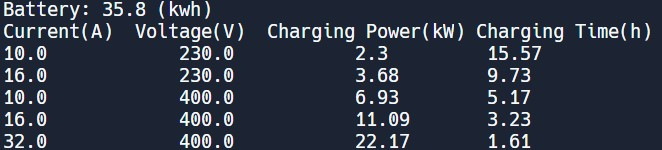

# Assignment 1 - Table print

## Learning Outcomes
* The student must show the ability to create a small program with a structured and annotated program flow. 
* The student should be able to show their understanding of:
  * declaring/initiating variables
  * using constants
  * making simple math calculations
  * making formatted string outputs

## How will you be graded
* You will be graded and checked for
  * If you have used constants in your program
  * Have read the coding rules and can use them in the code
  * Make a tabular output to the screen using appropriate print functions
* All the three above need to be met to pass the assignment

## Most typical mistakes that students do
* Do not use constants
* Do not read the coding rules
* Do the assignment without reading about the theory
* Do Not use ```printf()``` statement and formatting rules (this is usually because students don't read the required material and jump directly to the assignment)
* Have not seen the assignment one overview video on Canvas

## Note to those who have already done a programming course before
* There is no need to use for loop, if condition check, arrays. Yes, it makes it easy to write the program this way and probably more efficient. But that is not the goal of the assignment. Remember, the majority of the participants have yet to see these topics. So, solve the assignment as if you are yet to learn these topics in java programming. 


## Prerequisites
The assignment assumes that you have studied Modules 0 and 1, including the practice assignment Hello World.

## Task
Write a program that calculates and presents the table below in a tabular way. You should only create/use a single class in the assignments and use constants for values that do not change. 

Begin the task by constructing a flow chart and program logic on paper. Then describe your structure in text form (pseudocode) in the comment header of the program so that an outsider can understand what the program does and how your logic/algorithm works.

Your goal is to calculate how much time it takes to charge an electric car. The following is known
* Battery capacity is 35.8 kWh
* Charging power (W) = current (A) x voltage (V) (for single-phase 230V)
* Charging power (W) = current (A) x voltage (V) x square_root(3) (three-phase 400V).
  * You can use ```Math.sqrt()``` function
* 1kW = 1000 W
* Charging time = Battery capacity (KWh) / Charging power(kWh)
* Assume that battery is always charged from 0 to 100% and the power does not wary and remains constant at all times.
* You only calculate the values for the five different Voltage and current combinations shown in the table. There is no need to ask the user for input, etc. 

Note that the calculations must be "manually" rounded to a maximum of two decimal places. The program should round the values to 2 decimal places. See example in Data Bank 2 on Canvas (using ```Math.round()``` function)

Use can use methods in ```java.lang.Math``` (ex: the square root ``` Math.sqrt ()```) in your calculations. You should, therefore, **not use** Java conversions (ex: DecimalFormat class) to do this conversion.

Text in the printouts can be hard-coded (these need not be constants); you enter the "text string" to be printed directly in the ```printf``` command.

Your program should print the following: (ignore the central align for Charging Power, all columns can either be left or right-aligned)

 (The screenshot is from replit. Hence it is black; it may be different color based on what theme you choose. The text should be as shown, don't worry if the background is not black for you)

## Submit the solution
Before submitting the file, could you check that your code follows the course's requirements for formatting and coding rules (see corresponding criteria in the correction matrix on replit)? 

## Plagiarism 
When writing the code, make the code your own. Submissions may be checked for plagiarism, and the student will be reported to the university's Disciplinary Board in the event of cheating.

## Correction / When will I be graded
If you submit on time, you should typically have the information corrected no later than three weeks after the deadline. Any submission made after the deadline will have delays; we cannot say how long this takes.

NOTE! If you encounter problems so you can not complete the task, ask the teacher (Sandeep Patil) instead of submitting a half-finished solution. Please don't submit an incomplete solution. It is not time efficient.

The teacher marks how well the code meets the assignment requirements. Any failed submissions must be reworked to achieve an approved level and resubmitted (click "Submit again" on replit and then resubmit on Canvas).  